<div align="center">

#  TrocLivre

### Plateforme web communautaire d'échange, de don et de vente de livres

Projet universitaire réalisé individuellement dans le cadre de la Licence 2 Informatique.


</div>

---

# Présentation

TrocLivre est une application web développée individuellement ayant pour objectif de favoriser la réutilisation des livres grâce à une plateforme communautaire de partage.

Les utilisateurs peuvent publier des ouvrages à vendre, à donner ou à prêter, consulter les annonces disponibles, gérer leurs livres, échanger avec les autres membres via une messagerie intégrée et suivre leurs différentes transactions.

Ce projet m'a permis de développer une application web complète en réalisant l'ensemble des couches de l'application : conception de la base de données, développement Backend, création des interfaces Frontend et intégration des fonctionnalités métiers.

---

# Fonctionnalités principales

| Fonctionnalité | Description |
|----------------|-------------|
| Authentification | Création de compte et connexion sécurisée |
| Bibliothèque | Consultation de l'ensemble des livres disponibles |
| Gestion des livres | Publication, modification et suppression d'annonces |
| Vente et don | Mise en vente ou don d'un ouvrage |
| Favoris | Sauvegarde des livres favoris |
| Messagerie | Communication entre utilisateurs |
| Profil | Consultation et modification des informations personnelles |
| Transactions | Historique des échanges réalisés |

---

# Technologies utilisées

| Catégorie | Technologies |
|-----------|--------------|
| Backend | Python • Flask |
| Frontend | HTML5 • CSS3 • JavaScript |
| Base de données | SQLite |
| Moteur de templates | Jinja2 |
| Outils | Git • GitHub |

---

# Architecture technique

```text
                     Utilisateur
                          │
                          ▼
              HTML • CSS • JavaScript
                          │
                          ▼
                 Flask (Python Backend)
                          │
                          ▼
                       SQLite
```

---

# Aperçu de l'application

## Accueil

### Accueil (visiteur)

Interface d'accueil présentant la plateforme et permettant d'accéder aux livres disponibles.

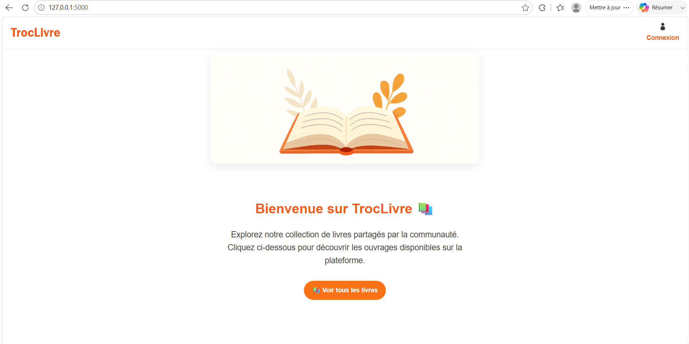

---

### Connexion

Authentification d'un utilisateur existant.

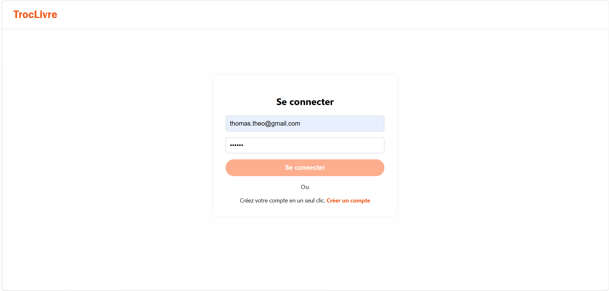

---

### Inscription

Création d'un nouveau compte utilisateur.

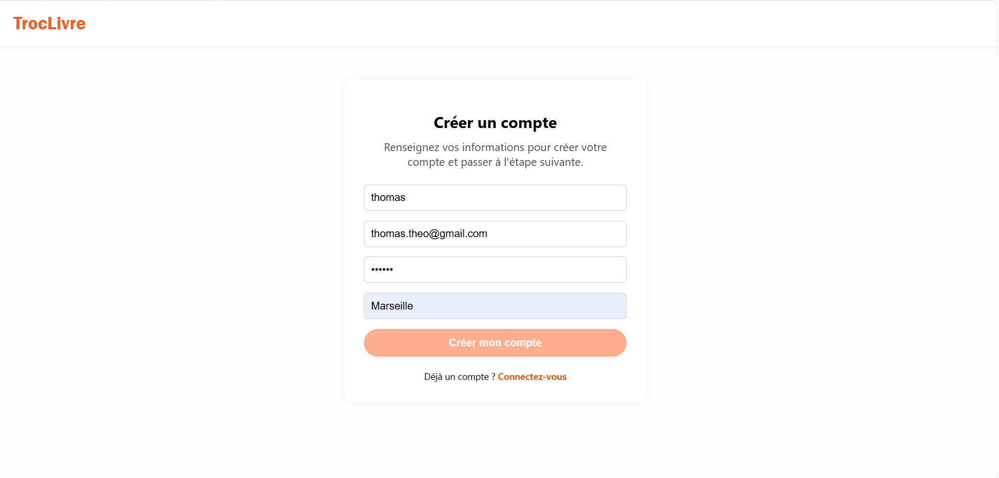

---

### Accueil (utilisateur connecté)

Accueil personnalisé après authentification.

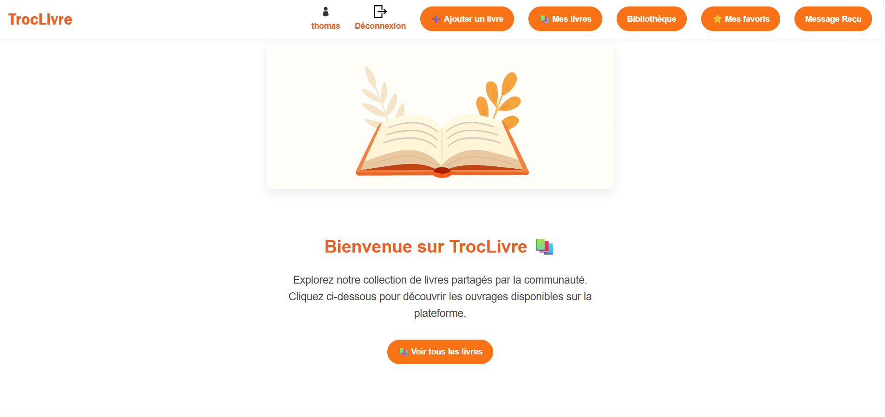

---

## Gestion des livres

### Choix d'une annonce

Sélection du type d'annonce : don ou vente.

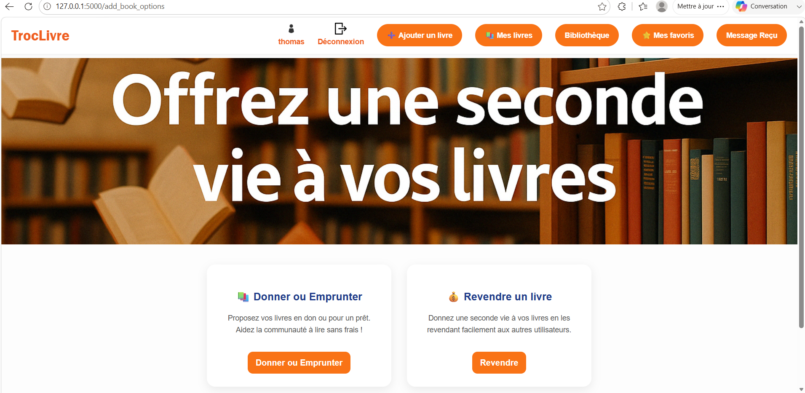

---

### Ajouter un livre à vendre

Création d'une annonce de vente.

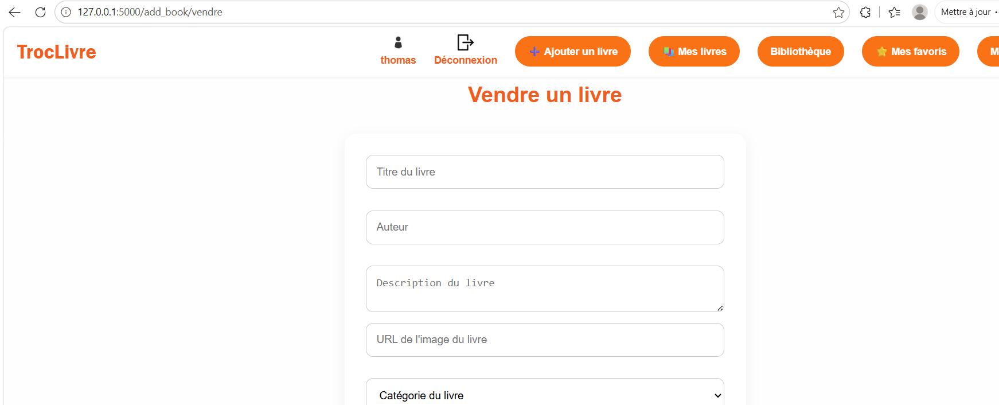

---

### Ajouter un livre à donner

Publication d'un livre en don.

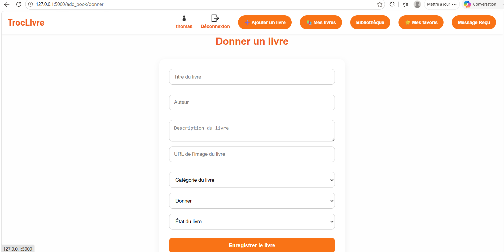

---

### Bibliothèque

Consultation des livres proposés par la communauté.

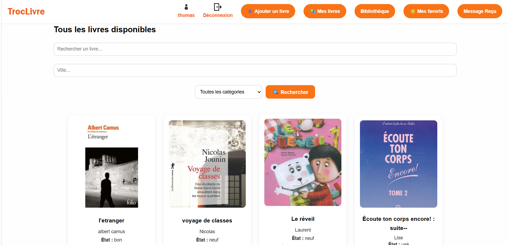

---

### Mes livres

Gestion des ouvrages publiés.

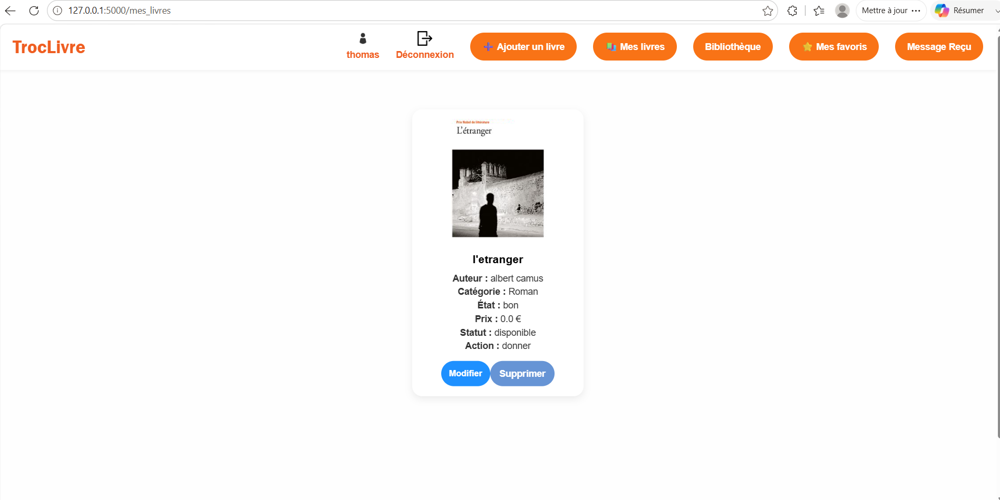

---

### Favoris

Consultation des livres enregistrés en favoris.

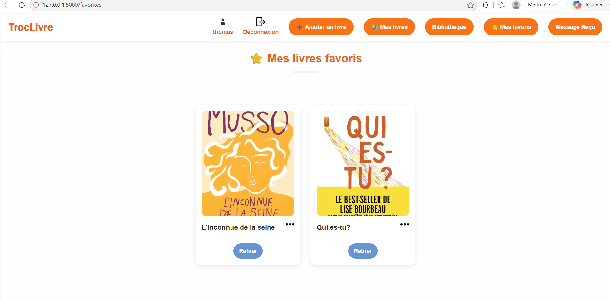

---

## Profil utilisateur

Gestion des informations personnelles et accès à l'historique.

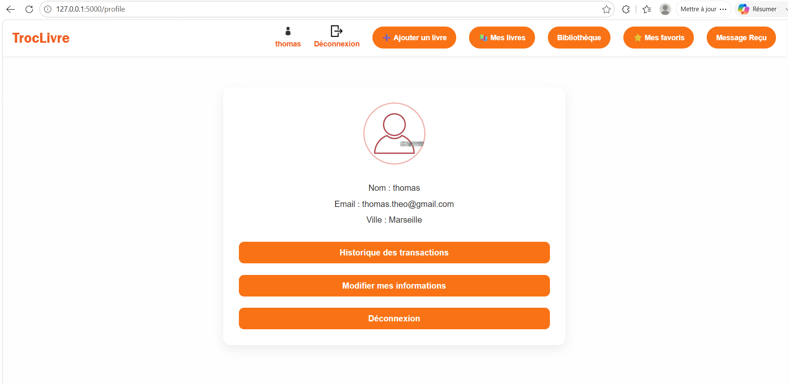

---

## Messagerie

### Liste des conversations

Visualisation des échanges avec les autres utilisateurs.

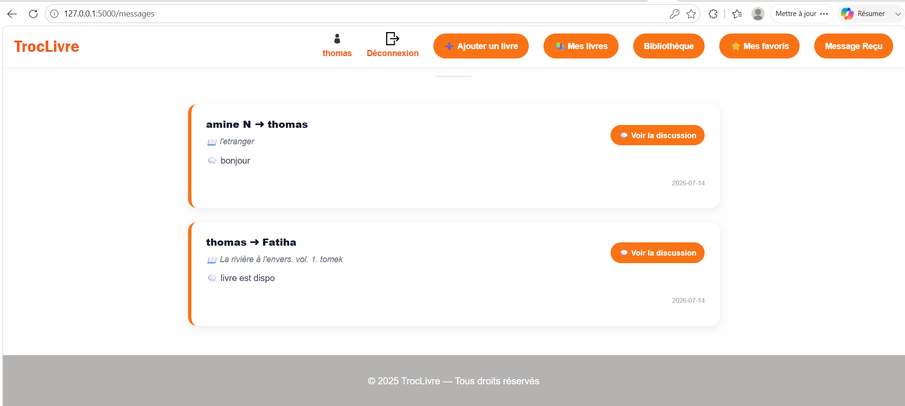

---

### Discussion

Messagerie permettant de communiquer directement avec un utilisateur.

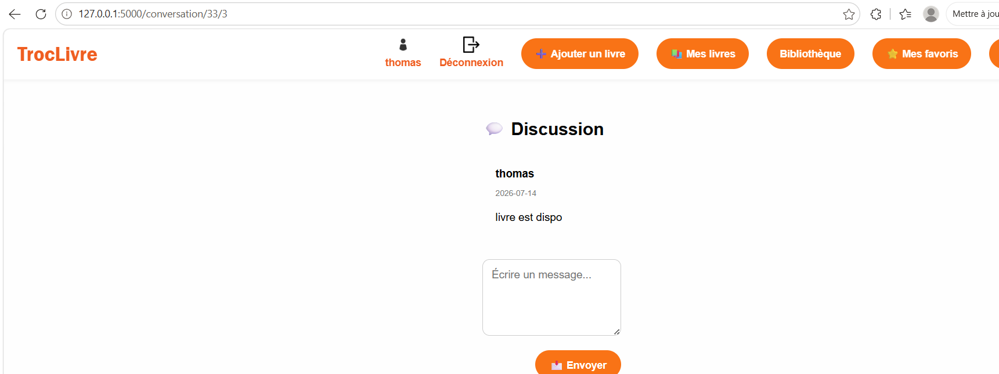

---

# Structure du projet

```text
TrocLivre
│
├── static/
│   ├── css/
│   ├── images/
│   └── js/
│
├── templates/
│
├── app.py
├── create_db.py
├── data_model.py
└── README.md
```

---

# Installation

```bash
git clone https://github.com/Lyna-NAILI14/TrocLivre.git

cd TrocLivre

pip install flask

python app.py
```

L'application est ensuite accessible à l'adresse :

```text
http://127.0.0.1:5000
```

---

# Compétences développées

Au travers de ce projet, j'ai développé les compétences suivantes :

- Développement Backend avec Flask
- Conception d'une base de données SQLite
- Développement d'interfaces web avec HTML, CSS et JavaScript
- Gestion de l'authentification utilisateur
- Manipulation des données avec Python
- Organisation d'un projet web complet
- Utilisation de Git et GitHub

---

# À propos

Ce projet a été réalisé dans le cadre de ma deuxième année de Licence Informatique.

Le code source est disponible à des fins de démonstration de mes compétences et d'illustration de mon parcours académique.
